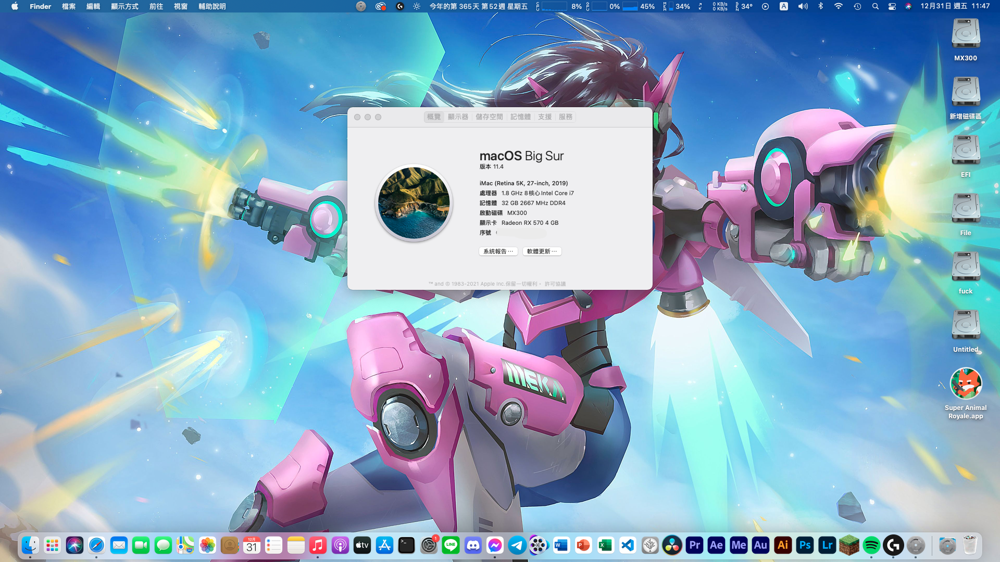

# B360M Pro VDH Opencore

OpenCore 0.7.5 setup for running Hackintosh on MSI B360M Pro VDH

## Desktop Specifications:
- Intel Core i7 9700TE
- Intel UHD 630 Graphics

- MSI B360M Pro VDH
- 32GB DDR4-2666MHz RAM
- MSI RX570 4G Gaming X
- Seasonic Focus GX 750
- BCM94360CD
- SATA SSD 120G+SATA SSD 275G+WD M.2 SATA 240G SSD+HDD 1T

- Twin 1080P  Display
- Logitech G304
- Avermedia AM310
- Ducky One 3 Matcha 100%

## What works:
- macOS Big Sur 11.1
- UEFI booting via OpenCore
- HDMI Video and Audio
- Native Ethernet
- Wifi,Bluetooth and AirDrop
- Native audio with AppleALC, including headphone
- Native power management
- USB 3.0 Ports
- Ethernet
- Sleep and Wake

